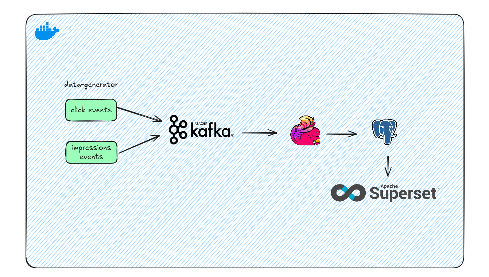
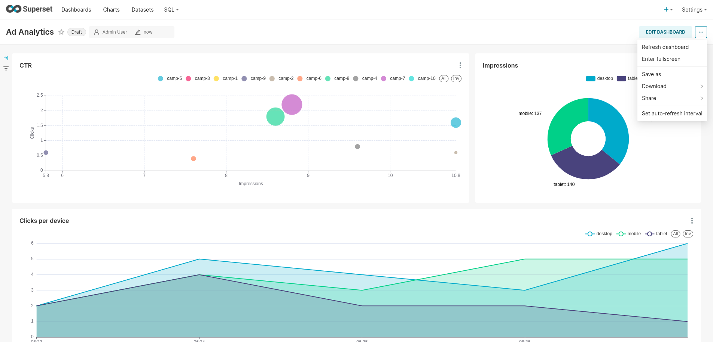

# Real-Time Ad Analytics with Flink, Kafka, and Superset

This project showcases a real-time analytics pipeline using modern streaming technologies. The system processes simulated ad impression and click data, computes metrics such as click-through rate (CTR) and user engagement, and visualizes the results through a Superset dashboard.

## Overview of the Architecture



- A **data generator** produces two Kafka streams: ad impressions and clicks.
- **Apache Flink** joins and aggregates these streams in near real-time.
- The results are written into a **PostgreSQL** database.
- **Apache Superset** connects to PostgreSQL and visualizes the metrics in a dashboard.

## Project Structure

```
.
├── dashboard/              # Superset dashboard export
│   └── dashboard.zip
│   └── init.sql            # SQL initialization scripts
├── data-generator/         # Kafka event producer
│   └── generate_events.py
├── flink/                  # Flink job (PyFlink)
│   └── ad_metrics_job.py
├── docker-compose.yml      # All-in-one service setup
├── init.sh                 # One command to build, run and deploy
└── README.md
```

## What the Flink Job Does

The Flink job, defined in `ad_metrics_job.py`, performs two main tasks using SQL-based streaming APIs:

1. **CTR by Campaign**  
   - Joins impressions and clicks by `impression_id`.
   - Aggregates per minute windows.
   - Calculates:
     ```
     CTR = clicks / impressions
     ```

2. **Engagement by Device Type**  
   - Groups by `device_type`.
   - Counts impressions and clicks per minute.

Additional features:
- Uses event-time processing with watermarks.
- Configured with RocksDB as the state backend for fault tolerance.
- Executes with parallelism set to 2.

The output of both aggregations is written directly to PostgreSQL tables: `ctr_by_campaign` and `engagement_by_device`.

## How to Run the Project

1. **Run all services and deploy the job**

   ```bash
   ./init.sh
   ```

   This script:
   - Builds Docker images
   - Starts Kafka, Flink, PostgreSQL, and Superset
   - Waits for services to be ready
   - Submits the Flink job

2. **Access Superset**

   - Open your browser at: [http://localhost:8088](http://localhost:8088)
   - Login credentials:
     - Username: `superset`
     - Password: `superset`

3. **Import the Superset dashboard**

   - Go to `Settings > Import/Export`.
   - Upload the file `dashboard/dashboard.zip`.

4. **Optional: Enable auto-refresh**

   In the dashboard menu (top right corner), select:
   ```
   Set auto-refresh interval → 10 seconds
   ```
   This allows real-time updates as data flows in.

## Dashboard Preview



The dashboard displays:
- CTR per campaign over time
- Impressions per device
- Click trends

This gives a live, interactive view of your streaming pipeline in action.